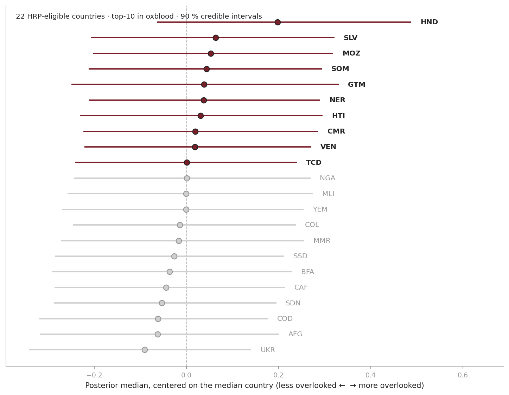
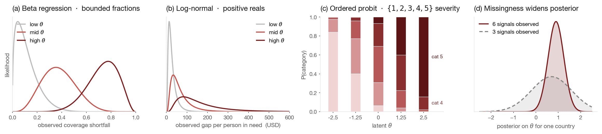
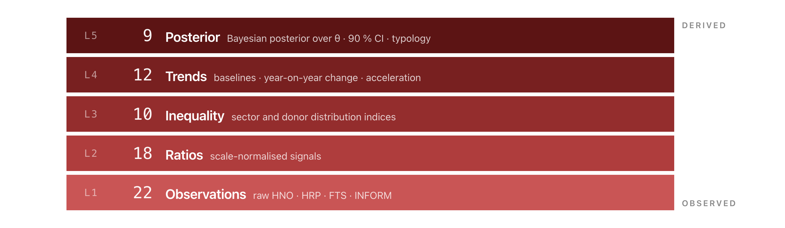
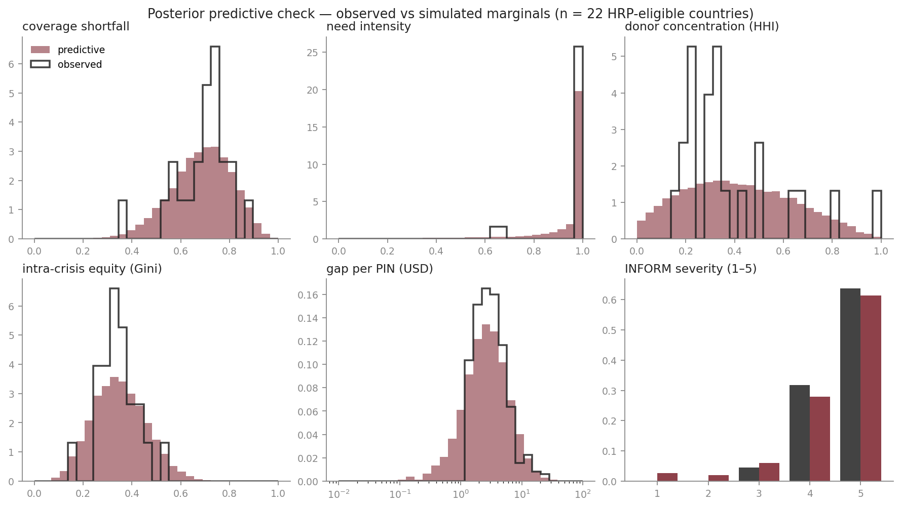
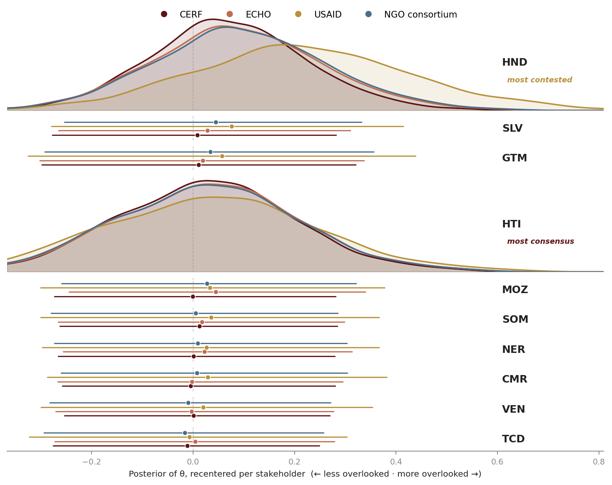
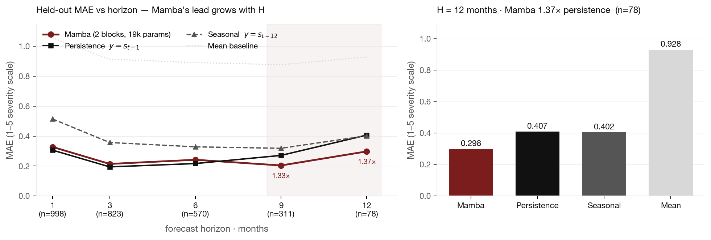

# Geo-Insight

> ⚠️ **Hackathon proof-of-concept.** Built for **Datathon 2026** as a student team submission. This is **not** a policy recommendation, **not** a production decision-support system, **not** peer-reviewed research, and **not** endorsed by any of the data providers referenced below (UN OCHA, CERF, CARE, EU JRC DRMKC, IPC, and others). Rankings are statistical estimates with calibrated uncertainty intervals and must not be used to allocate humanitarian funding or to substitute for the judgement of humanitarian coordinators, donors, or affected communities. Third-party data and code attributions live in [`NOTICE.md`](NOTICE.md); the code is MIT-licensed (see [`LICENSE`](LICENSE)).

**Which humanitarian crises are most overlooked?** In 2026 agencies asked for **$33 B** to reach **135 M people**; the 2025 appeal raised **$12 B** — the lowest in a decade — and 19 country responses are now below 50 % covered. When nearly every response is underfunded, a single coverage ratio stops discriminating. Geo-Insight treats **overlookedness as a latent scalar θ**, infers its posterior from six observed signals through a hierarchical Bayesian model, and validates the result against independently-curated expert lists.

<p align="center">
  
</p>

<p align="center"><sub>Twenty-two HRP-eligible countries on a single overlookedness axis. Posterior median and 90 % credible interval per country, recentered on the median. The ten highlighted are the top-10 — but intervals overlap across most of them, so <em>membership</em> in the set is the defensible claim, not the <em>ordering</em> within.</sub></p>

---

## The answer in one paragraph

Overlookedness θ is a latent scalar per country — never observed directly. We observe six attributes through likelihoods matched to each attribute's support: **Beta regression** for four bounded fractions (coverage shortfall, need intensity, donor concentration, sector equity), **log-normal** for the per-person-in-need funding gap, **ordered logistic** for INFORM severity. The six slopes are sign-constrained positive (HalfNormal priors), so larger attribute values always mean *more* overlooked. A Gaussian population-level prior on θ pools partial-data countries toward the global mean — sparse-data countries get wider posteriors structurally, not by downweighting. Inference is variational with `AutoMultivariateNormal` (~3 s on a CPU) and calibrated against NUTS on every run.

<p align="center">
  
</p>

## No magic numbers

Every analytic quantity is a named property in a single specification file — [`analysis/spec.yaml`](analysis/spec.yaml) — **71 properties across five derivation levels**: L1 raw observations (22 primitives from HNO, HRP, FTS, CoD-PS, INFORM), L2 scale-normalised ratios (18), L3 inequality indices (10), L4 windowed trends (12), L5 Bayesian posterior (9). Each property declares its formula, source dataset, input lineage, unit, and known failure modes *before* it is computed. Nothing reaches a rendered surface without a registered declaration. The effect is that every number in this README, on the landing page, in the deck, and in the proposal is chased back to one line of the spec and from there to a source file.

<p align="center">
  
</p>

## Top-10 most overlooked · 2025 cycle

**HND · SLV · MOZ · SOM · GTM · NER · HTI · CMR · VEN · TCD**

The model fits on **22 HRP-eligible countries** — those with an active humanitarian response plan and both HNO and FTS entries. That's the same pool CERF's Underfunded Emergencies list draws from, so external validation is on matched support. Countries without an HRP return *no* posterior — the construct "overlooked humanitarian crisis" isn't well-defined for them, and their absence from the ranking is a feature, not a bug.

## External validation · against independent human-curated benchmarks

Neither benchmark is used in fitting. **CERF UFE** — the UN's twice-yearly allocations to underfunded crises. **CARE Breaking the Silence** — the annual top-10 most under-reported crises. A naïve mean of the six signals on the same pool is our floor.

| Benchmark (selection date)     | k    | **Bayesian** | Naïve mean |
| ------------------------------ | ---- | ------------ | ---------- |
| CERF UFE 2024 w2 (Dec 2024)    | 10   | 3 / 10       | 3 / 10     |
| CERF UFE 2025 w1 (Mar 2025)    | 10   | **5 / 10**   | **5 / 10** |
| CERF UFE 2025 w2 (Dec 2025)    |  7   | **2 / 7**    | 1 / 7      |
| CARE BTS 2024                  | 10   | **3 / 10**   | 1 / 10     |

- **Out-of-sample:** a 2024-only fit predicts CERF's March-2025 picks at **4 / 10**, without ever seeing 2025 data.
- **Year-over-year stability:** 7 / 10 top-10 overlap between cycles.
- **Posterior-predictive coverage:** ≥ 0.91 on every one of the six attributes (target 0.90).
- **SVI vs NUTS calibration:** Spearman ρ = 0.89, credible-interval widths within 2×.

<p align="center">
  
</p>

## Stakeholder lens · consensus vs contested

Agencies disagree on *what should count*, not on *the answer*. We encode four pre-registered agency preferences — **CERF** weights severity, **ECHO** weights sectoral equity, **USAID** weights donor concentration, **NGO consortia** weight cluster-level equity — as four different priors over the six slopes. Each yields its own posterior on θ. **5 of 22** countries sit in the top-10 under *every* stakeholder lens (full consensus); **11** are top-10 under *some* but not all (contested). Honduras is the most contested (USAID's posterior visibly further right); Haiti is the most consensus (all four posteriors stack tight — the data overrides every prior).

<p align="center">
  
</p>

## Bonus · forecasting severity twelve months out

A 19 k-parameter selective state-space model — **Mamba** — reads 24 months of the INFORM panel and forecasts mean severity *H* months ahead. No funding data, no θ, no stakeholder priors. At short horizons, **persistence** ("severity next year equals today's") is unbeatable — severity is a slow 1–5 ordinal. At **H = 9** Mamba crosses below persistence; at **H = 12** it leads by **1.38×** (MAE 0.294 vs 0.407) on 78 held-out windows. We don't claim a universal win — the horizon curve is the result.

<p align="center">
  
</p>

---

## Run it

```bash
git clone git@github.com:BenBullinger/GEO-Insight.git
cd GEO-Insight
./run.sh
```

Opens the landing page in your default browser. `Ctrl-C` shuts everything down cleanly. First run downloads ~270 MB of source data and creates a Python virtualenv (3–5 minutes total); subsequent runs start in seconds. Everything runs on localhost — no public hosting.

| Surface             | URL                                                | What it is                                                                                  |
| ------------------- | -------------------------------------------------- | ------------------------------------------------------------------------------------------- |
| **Landing**         | <http://localhost:7777>                            | Hero narrative, interactive globe of the top-10, headline validation table                  |
| Methodology         | <http://localhost:7777/methodology/>               | Eight-section technical walkthrough — latent θ, likelihoods, priors, validation, calibration|
| Presentation        | <http://localhost:8000>                            | Reveal.js slide deck; `?print-pdf` for PDF export                                           |
| Data exploration    | <http://localhost:8501>                            | Provenance audit across the five primary sources + INFORM                                   |
| Analysis            | <http://localhost:8502>                            | Eight lenses × six modes, Bayesian posterior atlas, external validation                     |
| Proposal            | [`proposal/proposal.pdf`](proposal/proposal.pdf)   | Seven-page paper — methodology, validation, results                                         |

<details>
<summary><b>Prerequisites, individual surfaces, troubleshooting</b></summary>

**Prereqs:** Python 3.9+ and a Unix-like shell with `bash`. Tested on macOS; Linux works; Windows users use WSL. ~280 MB disk after first-run data download. No Node, no npm, no Docker.

**Individual launches** (if a port conflicts or you only want one surface):

```bash
python3 -m http.server 7777 --directory landing
python3 -m http.server 8000 --directory presentation
dashboard/.venv/bin/streamlit run dashboard/app.py
dashboard/.venv/bin/streamlit run analysis/app.py --server.port 8502
```

**Re-running the model standalone:**

```bash
dashboard/.venv/bin/python -m analysis.bayesian.hierarchical   # fit + NUTS calibration + benchmarks
dashboard/.venv/bin/python -m analysis.bayesian.ppc             # posterior-predictive figure
dashboard/.venv/bin/python -m analysis.bayesian.temporal_holdout  # 2024-only fit vs 2025 CERF
dashboard/.venv/bin/python -m analysis.bayesian.stakeholders    # four stakeholder posteriors
```

**Troubleshooting:** `lsof -nP -iTCP:<port> -sTCP:LISTEN` to find what's holding a port. `python3 Data/download.py --check` to audit the local data mirror. `rm -rf dashboard/.venv && ./run.sh` to wipe the venv and reinstall.

</details>

---

## Repository map

```
GEO-Insight/
├── README.md · LICENSE · NOTICE.md · run.sh     top-level
├── landing/                                      hero, globe, 8-section methodology
├── presentation/                                 reveal.js deck + vendored reveal.js 6.0.1
├── proposal/                                     LaTeX paper + methodology.md + metric_cards.md
├── dashboard/                                    port 8501 — raw-data audit (Streamlit)
├── analysis/                                     port 8502 — semantic analysis
│   ├── spec.yaml                                  canonical ontology — 71 properties, 8 lenses, 6 modes
│   ├── features.py · ontology.py · validation.py  L1 loaders, property registry, benchmark scoring
│   ├── bayesian/                                  hierarchical model, PPC, temporal held-out, stakeholders
│   ├── aggregations/                              L3 concentration, L4 temporal, L5 composites
│   ├── learned/                                   Mamba severity forecaster (L4 learned feature)
│   └── views/                                     atlas, PCA, cluster, profile, cross-lens, validation
├── Data/                                         official + third-party sources
│   ├── download.py                                reproducible fetcher (stdlib only)
│   ├── Third-Party/Benchmarks/                    CERF UFE + CARE BTS curated lists
│   ├── Third-Party/DRMKC-INFORM/                  INFORM Severity monthly panel + consolidator
│   └── {hno,hrp,cod-ps,fts,cbpf,learned}/         official source data (downloaded, gitignored)
└── scripts/refresh_enriched.py                   materialise analysis/enriched.parquet
```

## Principles

- **Single source of truth.** [`analysis/spec.yaml`](analysis/spec.yaml) declares every property with its formula, source, inputs, unit, and known failure modes. No analytic column exists in code that isn't registered there.
- **Honest uncertainty.** Every score is a posterior; every ranking comes with a 90 % credible interval; the variational fit is calibrated against NUTS on every run.
- **Honest scope.** The model fits HRP-eligible countries only. Countries without an active response plan return no posterior, not a guess. **Missingness widens posteriors, never shifts them** — no imputed values reach the fit.
- **Decision support, not automation.** The tool ranks; humans decide. Every displayed value carries its provenance.

## What we are not claiming

- **Not causal.** The observation model is statistical association, not intervention.
- **Not a forecast of humanitarian outcomes.** The Mamba forecaster predicts *severity* only; θ itself is cross-sectional per cycle.
- **Not a replacement for expert judgement.** Every ranking is decision support.
- **Not observed directly.** θ is latent by definition; every claim is contingent on the observation model being approximately correct. External validation gives evidence, not proof — and the benchmarks themselves are imperfect proxies (CERF UFE reflects a political process; CARE BTS reflects media attention).

## References

- **Proposal (7 pages):** [`proposal/proposal.pdf`](proposal/proposal.pdf)
- **Long-form methodology (11 sections):** [`proposal/methodology.md`](proposal/methodology.md)
- **Metric cards:** [`proposal/metric_cards.md`](proposal/metric_cards.md)
- **External benchmarks:** [`Data/Third-Party/Benchmarks/README.md`](Data/Third-Party/Benchmarks/README.md)
- **Data sources:** [`Data/README.md`](Data/README.md)
- **Third-party attributions & licences:** [`NOTICE.md`](NOTICE.md)

---

<sub>Datathon 2026 hackathon submission · MIT licensed · see [`NOTICE.md`](NOTICE.md) for third-party attributions</sub>
